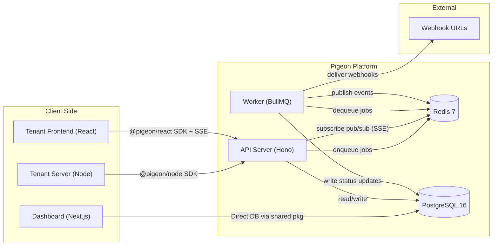
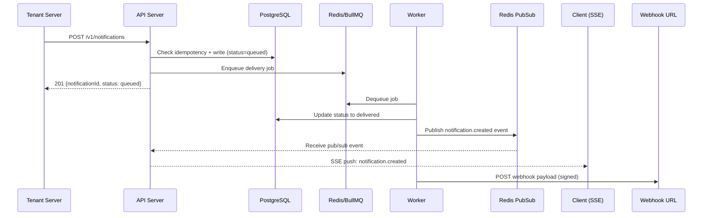

# Pigeon - Notifications SaaS MVP - Technical Implementation Plan

## Architecture Overview



### Notification Send Flow



**Key design choice (improvement over PRD):** The API writes the notification to the DB synchronously (status=queued) and then enqueues a delivery job. The PRD says "worker writes," but writing synchronously ensures: (a) the notification is immediately queryable, (b) idempotency checks are atomic, and (c) the `notificationId` returned is always valid. The worker's job is delivery (SSE broadcast, webhook dispatch) and status updates.

---

## Recommended Tech Stack

**Monorepo & Tooling:**

- pnpm workspaces + Turborepo
- TypeScript 5.x (strict mode)
- Biome (linting + formatting - single tool, fast)
- Docker Compose for local dev (PostgreSQL 16 + Redis 7)

**API Server (`apps/api`):**

- **Hono** - lightweight, fast, excellent TypeScript support, built-in SSE streaming
- **Drizzle ORM** - type-safe, lightweight, close to SQL
- **BullMQ** - Redis-based job queue, built-in retries + exponential backoff
- **jose** - JWT signing/verification (edge-compatible)
- **Zod** - request validation (shared with SDK types)
- **@hono/zod-validator** - Hono + Zod integration

**Worker (`apps/worker`):**

- BullMQ worker (separate Node.js process)
- Shared Drizzle DB client from `@pigeon/db`
- Webhook delivery with exponential backoff + HMAC-SHA256 signing

**Dashboard (`apps/dashboard`):**

- **Next.js 15** (App Router, Server Components, Server Actions)
- **Better Auth** (email/password, session management)
- **shadcn/ui** + **Tailwind CSS v4**
- **TanStack Query** for client-side data fetching
- Direct DB access via shared `@pigeon/db` package (no API intermediary)

**Backend SDK (`packages/sdk-node`):**

- Zero runtime dependencies (uses native `fetch`)
- Full TypeScript types exported

**Frontend SDK (`packages/sdk-react`):**

- React 18+ peer dependency
- `EventSource` for SSE with auto-reconnect
- Built with **tsup** for dual CJS/ESM output

---

## Monorepo Structure

```
pigeon/
├── apps/
│   ├── api/                 # Hono API server
│   │   ├── src/
│   │   │   ├── index.ts
│   │   │   ├── routes/      # Route handlers
│   │   │   ├── middleware/   # Auth, rate-limit, error handling
│   │   │   ├── services/    # Business logic
│   │   │   └── lib/         # Redis, queue setup
│   │   ├── package.json
│   │   └── tsconfig.json
│   ├── worker/              # BullMQ worker process
│   │   ├── src/
│   │   │   ├── index.ts
│   │   │   ├── processors/  # Job processors
│   │   │   └── lib/         # Webhook delivery, SSE publishing
│   │   ├── package.json
│   │   └── tsconfig.json
│   ├── dashboard/           # Next.js dashboard
│   │   ├── src/
│   │   │   ├── app/         # App Router pages
│   │   │   ├── components/  # UI components
│   │   │   ├── lib/         # Auth, DB queries, utils
│   │   │   └── hooks/       # Custom React hooks
│   │   ├── package.json
│   │   └── next.config.ts
│   └── demo/                # Demo app for acceptance criteria
│       ├── server/          # Express server using @pigeon/node
│       └── client/          # React app using @pigeon/react
├── packages/
│   ├── db/                  # @pigeon/db - Drizzle schema + migrations
│   │   ├── src/
│   │   │   ├── schema/      # Table definitions
│   │   │   ├── migrate.ts
│   │   │   └── index.ts     # Client + schema exports
│   │   ├── drizzle/         # Migration files
│   │   └── drizzle.config.ts
│   ├── sdk-node/            # @pigeon/node - Backend SDK
│   │   ├── src/
│   │   │   ├── client.ts
│   │   │   ├── types.ts
│   │   │   └── index.ts
│   │   └── tsup.config.ts
│   ├── sdk-react/           # @pigeon/react - Frontend SDK
│   │   ├── src/
│   │   │   ├── provider.tsx
│   │   │   ├── hooks/
│   │   │   ├── sse.ts
│   │   │   └── index.ts
│   │   └── tsup.config.ts
│   └── shared/              # @pigeon/shared - Types, Zod schemas, constants
│       ├── src/
│       │   ├── types.ts
│       │   ├── schemas.ts   # Zod validation schemas
│       │   └── constants.ts
│       └── tsup.config.ts
├── docker/
│   ├── Dockerfile.api       # Multi-stage build for API server
│   ├── Dockerfile.worker    # Multi-stage build for Worker
│   └── Dockerfile.dashboard # Multi-stage build for Dashboard
├── docker-compose.yml       # Full stack: PostgreSQL + Redis + API + Worker + Dashboard
├── docker-compose.dev.yml   # Dev override: only PostgreSQL + Redis (apps run locally)
├── turbo.json
├── pnpm-workspace.yaml
├── tsconfig.base.json
├── biome.json
└── .env.example
```

---

## Data Model

### Design Notes

- All primary keys are UUIDs (generated with `crypto.randomUUID()`)
- `environment_id` implies `project_id`, but `project_id` is denormalized on `notifications` and `end_users` for query performance
- Timestamps use `TIMESTAMPTZ`
- Soft deletes are not used for MVP (can add later)
- **Notification TTL**: Notifications older than 90 days are hard-deleted by a recurring worker job (daily BullMQ repeatable job). The `createdAt` index on notifications supports efficient range deletes.
- **Self-hostable readiness**: All configuration (DB, Redis, JWT secrets, base URLs) is driven by environment variables. No hardcoded cloud-specific logic. Docker Compose serves as both the local dev setup and the reference deployment unit for self-hosters.

### Tables

**Dashboard Auth (managed by Better Auth)**

- `users` - dashboard users (developers), columns: `id, email, name, emailVerified, image, createdAt, updatedAt`
- `sessions` - auth sessions, columns: `id, userId, expiresAt, token, ipAddress, userAgent, createdAt, updatedAt`
- `accounts` - auth accounts (for future OAuth), columns: `id, userId, accountId, providerId, ...`
- `verifications` - email verification tokens

**Multi-Tenancy**

- `projects` - `id, name, slug, createdAt, updatedAt`
- `project_members` - `id, projectId (FK projects), userId (FK users), role ('owner'|'member'), createdAt` with `UNIQUE(projectId, userId)`
  - `owner`: full access (settings, delete project, manage members, manage keys)
  - `member`: read/write access (logs, templates, webhooks, user inspector) but cannot delete project or manage members
  - The user who creates a project is automatically added as `owner`
- `project_invites` - `id, projectId, email, role, invitedBy (FK users), token (unique), expiresAt, acceptedAt, createdAt`
  - Invite flow: owner sends invite by email, recipient clicks link to join
- `environments` - `id, projectId (FK projects), name ('development'|'production'), jwtSecret (for signing user tokens), createdAt` with `UNIQUE(projectId, name)`
  - `jwtSecret` generated per-environment, used to sign end-user JWTs
- `api_keys` - `id, environmentId (FK environments), name, keyHash, keyPrefix (first 8 chars), isRevoked, createdAt, revokedAt`
  - Key format: `pk_live_` prefix for production, `pk_test_` for development (like Stripe)
  - Stored as bcrypt hash; plaintext shown once on creation

**Recipients**

- `end_users` - `id, projectId, environmentId, externalUserId, createdAt` with `UNIQUE(environmentId, externalUserId)`
  - Auto-created on first notification send (upsert pattern)

**Notifications**

- `notifications` - `id, projectId, environmentId, endUserId (FK end_users), type, title, body, data (JSONB), readAt, archivedAt, status ('queued'|'delivered'|'failed'), idempotencyKey, createdAt, updatedAt`
  - Partial unique index: `UNIQUE(environmentId, idempotencyKey) WHERE idempotencyKey IS NOT NULL`
  - Query index: `(environmentId, endUserId, createdAt DESC)`

**Webhooks**

- `webhook_endpoints` - `id, environmentId, url, secret (HMAC key), events (TEXT[]), isActive, createdAt, updatedAt`
  - Events: `['notification.created', 'notification.read']`
- `webhook_delivery_attempts` - `id, webhookEndpointId, notificationId, event, status ('pending'|'success'|'failed'), requestBody (JSONB), responseStatus, responseBody, error, attemptNumber, nextRetryAt, createdAt`

**Templates**

- `templates` - `id, environmentId, type, titleTemplate, bodyTemplate, createdAt, updatedAt` with `UNIQUE(environmentId, type)`
  - Uses `{{variable}}` interpolation syntax with `data` object

---

## API Design

### Authentication

- **Server-to-server**: API key in `Authorization: Bearer pk_live_xxx` header. Middleware looks up by prefix, verifies hash, extracts `environmentId` + `projectId`.
- **Client (frontend SDK)**: Short-lived JWT in `Authorization: Bearer <jwt>` header. JWT payload: `{ sub: externalUserId, pid: projectId, eid: environmentId, exp: ... }`. Signed with environment-specific HMAC secret stored in DB.

### Endpoints

**Server-authenticated (API key):**

| Method | Path                      | Description                                                 |
| ------ | ------------------------- | ----------------------------------------------------------- |
| POST   | `/v1/notifications`       | Send a notification (writes to DB + enqueues delivery)      |
| POST   | `/v1/notifications/batch` | Send up to 100 notifications at once **(new - not in PRD)** |
| POST   | `/v1/users/:userId/token` | Mint a short-lived JWT for a user                           |

**Client-authenticated (JWT):**

| Method | Path                            | Description                                                      |
| ------ | ------------------------------- | ---------------------------------------------------------------- |
| GET    | `/v1/notifications`             | List notifications for the authenticated user (cursor-paginated) |
| POST   | `/v1/notifications/:id/read`    | Mark a notification as read                                      |
| POST   | `/v1/notifications/read-all`    | Mark all notifications as read                                   |
| POST   | `/v1/notifications/:id/archive` | Archive a notification **(new - not in PRD)**                    |
| GET    | `/v1/stream`                    | SSE realtime connection                                          |

**Internal / Dashboard (session-authenticated via Better Auth):**

- Dashboard accesses the DB directly via the shared `@pigeon/db` package (Next.js Server Actions / Route Handlers). No separate admin API needed for MVP.

### Pagination (improvement over PRD)

Use **cursor-based pagination** instead of offset-based. Better for real-time data where items are constantly being added.

```
GET /v1/notifications?limit=20&cursor=<notificationId>
Response: { items: [...], nextCursor: "xxx" | null }
```

### Rate Limiting (not in PRD - recommended addition)

- Per API key: 100 req/s for send, 1000 req/s for reads
- Use sliding window counter in Redis
- Return `429 Too Many Requests` with `Retry-After` header

---

## SDK Design

### Backend SDK (`@pigeon/node`)

```typescript
import { Pigeon } from '@pigeon/node';

const pigeon = new Pigeon({
  apiKey: 'pk_live_xxx',
  baseUrl: 'https://api.pigeon.dev', // optional, defaults to hosted
});

// Send a single notification
const { id, status } = await pigeon.send({
  userId: 'user_123',
  type: 'invoice.paid',
  title: 'Invoice Paid',
  body: 'Your invoice #1234 has been paid.',
  data: { invoiceId: '1234', amount: 99.99 },
  idempotencyKey: 'inv_1234_paid', // optional
});

// Batch send (new - not in PRD)
const results = await pigeon.sendBatch([
  { userId: 'user_1', type: 'welcome', title: 'Welcome!' },
  { userId: 'user_2', type: 'welcome', title: 'Welcome!' },
]);

// Create a user token for the frontend
const { token, expiresAt } = await pigeon.createUserToken({
  userId: 'user_123',
  ttlSeconds: 3600, // optional, default 1h
});
```

### Frontend SDK (`@pigeon/react`)

**Improvement over PRD:** Use a `tokenProvider` callback instead of a static `token` prop. This allows the SDK to automatically refresh tokens when they expire.

```tsx
import { PigeonProvider, useNotifications } from '@pigeon/react';

// In app root - tokenProvider fetches fresh tokens
<PigeonProvider
  apiUrl="https://api.pigeon.dev"
  tokenProvider={async () => {
    const res = await fetch('/api/notifications/token');
    const { token } = await res.json();
    return token;
  }}
>
  <App />
</PigeonProvider>;

// In a component
function NotificationBell() {
  const {
    notifications,
    unreadCount,
    isLoading,
    error,
    markRead,
    markAllRead,
    archive, // new - not in PRD
    fetchMore, // cursor-based pagination
    hasMore,
    connectionStatus, // new: 'connected' | 'connecting' | 'disconnected'
  } = useNotifications({ pageSize: 20 });

  return (
    <div>
      <span>Unread: {unreadCount}</span>
      {notifications.map((n) => (
        <div key={n.id} onClick={() => markRead(n.id)}>
          {n.title}
        </div>
      ))}
      {hasMore && <button onClick={fetchMore}>Load more</button>}
    </div>
  );
}
```

**SSE internals:**

- Uses `EventSource` under the hood
- Auto-reconnect with exponential backoff (1s, 2s, 4s... max 30s)
- Optimistic updates for `markRead`/`markAllRead`
- `connectionStatus` exposed for UI feedback (e.g., "reconnecting..." banner)
- When token expires, automatically calls `tokenProvider` and reconnects

---

## Dashboard Pages

All routes under `/dashboard` with Better Auth protecting access. Project-level routes check `project_members` for authorization.

- `/login`, `/register` - Auth pages
- `/projects` - List projects the user is a member of, create new
- `/projects/:slug/settings` - Project settings, danger zone (delete - owner only)
- `/projects/:slug/members` - Team management: list members, invite by email, remove members, change roles (owner only)
- `/projects/:slug/environments/:env/keys` - API key management (create, revoke, show-once - owner only)
- `/projects/:slug/environments/:env/logs` - Notification logs (search by userId, type, status, date range)
- `/projects/:slug/environments/:env/users/:userId` - User inspector (all notifications for a specific end user)
- `/projects/:slug/environments/:env/templates` - Template CRUD
- `/projects/:slug/environments/:env/webhooks` - Webhook endpoint CRUD + delivery attempt logs

---

## Webhook Delivery Details

- **Signing**: Every webhook payload is signed with HMAC-SHA256 using the endpoint's secret. Signature sent in `X-Pigeon-Signature` header.
- **Payload**: `{ event: "notification.created", timestamp: "...", data: { ...notification } }`
- **Retries**: Exponential backoff - attempts at 0s, 30s, 2m, 15m, 1h, 4h (6 attempts total). Configurable via BullMQ job options.
- **Timeout**: 10s per delivery attempt.
- **Success**: HTTP 2xx response.
- **Visibility**: All attempts logged in `webhook_delivery_attempts` table, visible in dashboard.

---

## Suggested Improvements Over PRD

1. **Token Provider pattern** - The React SDK accepts a `tokenProvider` callback instead of a static `token`. This enables automatic token refresh without app-level logic. The static `token` prop should still work for simple cases.
2. **Synchronous DB write** - The API writes the notification to PostgreSQL immediately (status=queued) rather than having the worker write it. This ensures the returned `notificationId` is always immediately queryable and makes idempotency checks atomic.
3. **Cursor-based pagination** - Better than offset-based for real-time notification feeds where new items are constantly prepended.
4. **Batch send endpoint** - `POST /v1/notifications/batch` accepts up to 100 notifications. Common real-world need (e.g., "notify all team members").
5. **Archive/dismiss** - Users should be able to archive notifications, not just mark them as read. Adds `archivedAt` column and `archive()` method.
6. **Webhook HMAC signing** - Security best practice. Tenants can verify webhook authenticity.
7. **Rate limiting** - Essential for any SaaS API. Sliding window counter in Redis.
8. **Connection status** - The React SDK exposes `connectionStatus` so the UI can show reconnection state.
9. **API key prefix format** - `pk_live_xxx` / `pk_test_xxx` makes it easy to identify which environment a key belongs to (inspired by Stripe).
10. **Webhook event types** - The PRD mentions webhooks but doesn't define events. Defined: `notification.created`, `notification.read`.
11. **Dashboard auth** - Added Better Auth with email/password for developer access to the dashboard (missing from PRD entirely).
12. **Multi-user projects** - Added `project_members` table with `owner`/`member` roles and an invite-by-email flow. The PRD only had `ownerId` on projects.
13. **Notification TTL** - Automatic cleanup of notifications older than 90 days via a daily worker job. Keeps the database lean without manual intervention.
14. **Self-hosting readiness** - All config via env vars, Dockerfiles for every service, single `docker compose up` deployment. No cloud-vendor lock-in in core code.

---

## Self-Hosting Readiness

The app is built hosted-first but designed so that self-hosting is straightforward in the future:

- **All config via env vars**: Database URL, Redis URL, JWT secrets, base URLs, SMTP (for invites) -- nothing hardcoded.
- **Dockerfiles provided**: Multi-stage Dockerfiles for API, Worker, and Dashboard. The `docker-compose.yml` at the root runs the entire stack (PostgreSQL, Redis, API, Worker, Dashboard) as a single `docker compose up`.
- `**docker-compose.dev.yml**`: For local development, only spins up PostgreSQL + Redis; the apps run via `turbo dev` for hot reload.
- **SDK `baseUrl**`: Defaults to `https://api.pigeon.dev` (hosted) but is overridable for self-hosted instances.
- **No cloud-specific dependencies**: No AWS SDK, no Vercel-specific code in the core. The API, worker, and dashboard all run on standard Node.js.
- **Migration CLI**: `pnpm db:migrate` runs Drizzle migrations, usable by self-hosters during upgrades.

---

## Notification TTL (90-Day Cleanup)

- A BullMQ **repeatable job** runs daily (e.g., 3:00 AM UTC) in the worker process.
- It deletes notifications where `createdAt < NOW() - INTERVAL '90 days'`.
- Uses batched deletes (1000 rows at a time) to avoid long-running transactions.
- Associated `webhook_delivery_attempts` are cascade-deleted (or cleaned up in the same job).
- The 90-day threshold is configurable via `NOTIFICATION_TTL_DAYS` env var (defaults to 90).
