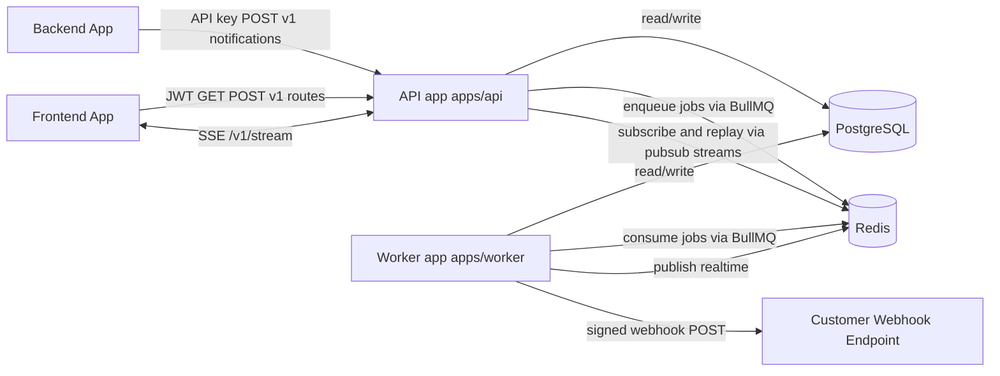
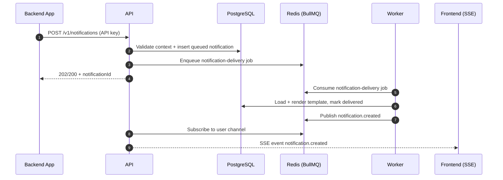
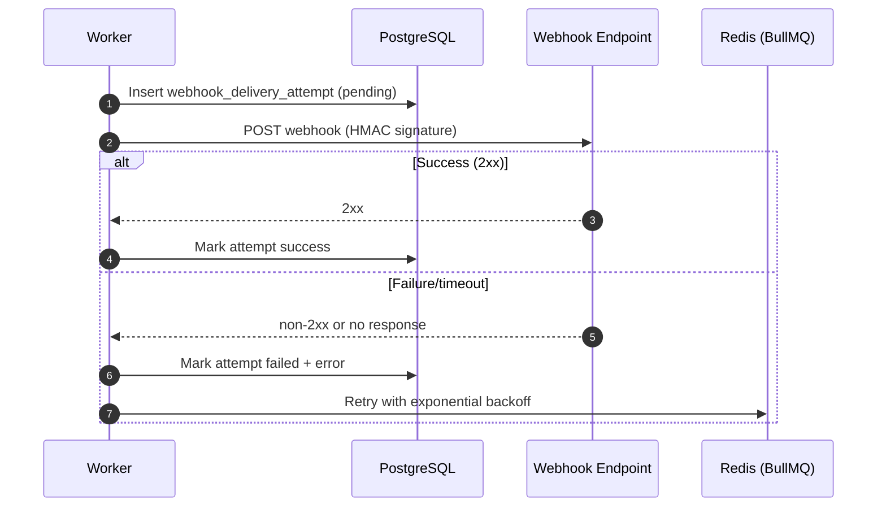
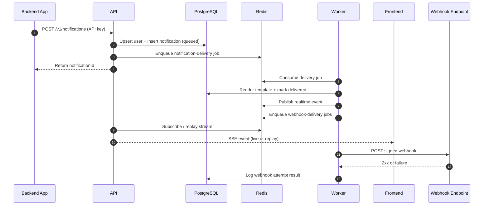
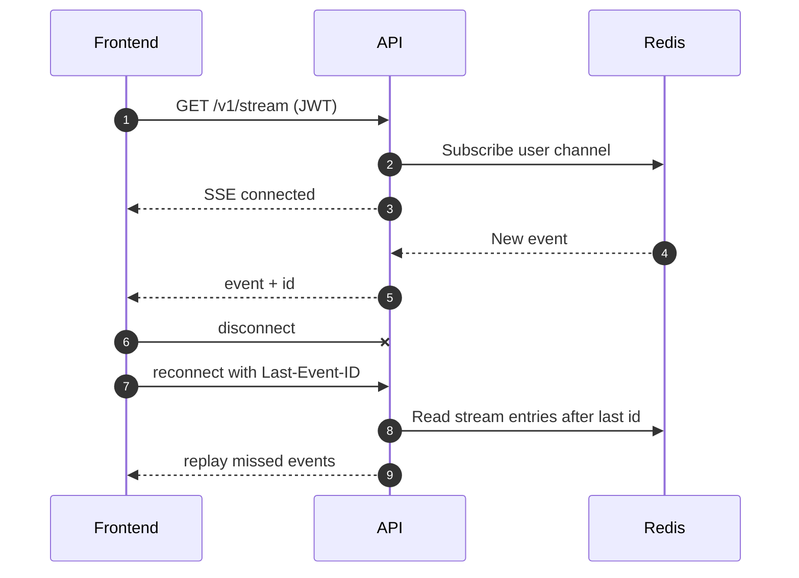

# Pigeon Architecture (Simple Overview)

This document explains how the system works today (through Phase 6).

## What Pigeon does

Pigeon is a multi-tenant notifications platform.

- Backend apps send notifications using an API key.
- Frontend apps read notifications using a short-lived user JWT.
- Users can get real-time updates over SSE.
- Worker processes handle delivery and webhooks in the background.

## Main pieces

1. API (`apps/api`)
- Receives requests from backend and frontend clients.
- Validates auth and request payloads.
- Writes notifications to PostgreSQL.
- Pushes delivery jobs to Redis (BullMQ).
- Serves SSE stream for real-time updates.
- Applies Redis-based rate limiting.

2. Worker (`apps/worker`)
- Pulls jobs from Redis queues.
- Marks notifications as delivered.
- Publishes real-time events.
- Sends signed webhook requests.
- Retries webhook failures.
- Runs daily cleanup for old notifications.

3. PostgreSQL
- Source of truth for projects, environments, users, notifications, templates, webhooks, and attempts.

4. Redis
- BullMQ queue backend.
- Pub/Sub for real-time events.
- Stream storage for SSE replay with `Last-Event-ID`.
- Sliding-window counters for rate limits.

5. Shared packages
- `@flypigeon/shared`: shared types, constants, and Zod schemas.
- `@flypigeon/db`: Drizzle schema + DB client + migrations.

## Architecture diagrams

Use a Markdown preview that supports Mermaid (GitHub and Cursor both do).

### 1) System map (big picture)



### 2) Notification delivery flow



### 3) Webhook + retry flow



### 4) End-to-end request lifecycle



## Data model in plain words

- A `project` has `environments` (`development`, `production`).
- API keys belong to an environment.
- End users are identified by `externalUserId` per environment.
- Notifications belong to one end user + environment + project.
- Notifications can be `queued`, `delivered`, or `failed`.
- Webhook endpoints are configured per environment.
- Webhook delivery attempts are logged for observability.

## Core request flows

### 1) Send notification (server to server)

1. Client calls `POST /v1/notifications` with API key.
2. API validates key and rate limits.
3. API upserts end user.
4. API inserts notification with status `queued`.
5. API enqueues BullMQ job (`notification-delivery`).
6. API returns `notificationId` immediately.

Flow summary: API does the fast database write first, then hands slow work to worker queue.

### 2) Deliver notification (worker)

1. Worker consumes `notification-delivery` job.
2. Worker loads notification + optional template.
3. Worker renders template (`{{variable}}`) if present.
4. Worker updates notification to `delivered`.
5. Worker publishes `notification.created` event to Redis.
6. Worker enqueues webhook jobs for active matching endpoints.

### 3) Frontend reads notifications

- `GET /v1/notifications` returns cursor-paginated data.
- `POST /v1/notifications/:id/read` marks one as read.
- `POST /v1/notifications/read-all` marks all as read.
- `POST /v1/notifications/:id/archive` archives one.

### 4) Real-time SSE

1. Frontend connects to `GET /v1/stream` with JWT.
2. API subscribes to user-specific Redis channel.
3. API forwards new events as SSE messages.
4. API sends keepalive pings.
5. On reconnect, API can replay missed events using `Last-Event-ID` from Redis Stream.



### 5) Webhook delivery

1. Worker takes webhook job.
2. Builds payload `{ event, timestamp, data }`.
3. Signs body with HMAC SHA-256 (`x-pigeon-signature`).
4. Sends POST request to endpoint.
5. Logs attempt result (`success` or `failed`).
6. BullMQ retries failed jobs with exponential backoff.

### 6) Cleanup

- Worker runs daily maintenance job.
- Deletes notifications older than `NOTIFICATION_TTL_DAYS` (default 90).
- Uses batched deletes to avoid long transactions.

## Auth model

1. API key auth (server requests)
- Header: `Authorization: Bearer pk_test_...` or `pk_live_...`
- API finds key by prefix and verifies hash.
- API resolves `projectId` and `environmentId` context.

2. JWT auth (frontend requests)
- Header: `Authorization: Bearer <jwt>`
- JWT includes `sub`, `pid`, `eid`, `exp`.
- API verifies signature with environment secret.

## Rate limiting

Redis + Lua sliding window:

- API key write routes: 100 req/sec.
- JWT read routes: 1000 req/sec.
- On limit hit: HTTP `429` + `retry-after` header.

## Queue layout

- `notification-delivery`: notification delivery jobs.
- `webhook-delivery`: webhook dispatch jobs.
- `maintenance`: cleanup jobs.

## Reliability choices

- API writes notification first, then enqueues job.
- Idempotency key prevents duplicates per environment.
- Worker is at-least-once; idempotency protects duplicates.
- Webhook attempts are fully logged.

## Local dev runbook

1. Start infra:
```bash
docker compose -f docker-compose.dev.yml up -d
```

2. Run services:
```bash
pnpm --filter @flypigeon/api dev
pnpm --filter @flypigeon/worker dev
```

3. Smoke tests:
```bash
pnpm test:phase4
pnpm test:phase5
pnpm test:phase6
```

## What is done vs pending

Done through Phase 6:
- Foundation, shared/db, API auth, API endpoints, SSE/rate limit, worker.

Not done yet:
- SDKs (`@flypigeon/node`, `@flypigeon/react`) implementation details.
- Dashboard auth/features.
- Demo app integration.
- Docker production stack and final polish.

## Why this architecture

- PostgreSQL gives strong consistency for core records.
- Redis gives fast queueing/realtime/rate-limit primitives.
- API stays thin and synchronous for writes.
- Worker handles slow and retry-heavy work.
- Shared package keeps contract consistency across apps.

This is a living document and should be updated as later phases add SDK and dashboard behavior.

## Legend (quick reference)

- `API key`: used by backend services for write endpoints (`POST /v1/notifications`).
- `JWT`: used by frontend clients for read endpoints and SSE.
- `SSE`: server-sent events stream (`GET /v1/stream`) for realtime updates.
- `notification-delivery` queue: worker job to render and mark notification delivered.
- `webhook-delivery` queue: worker job to send signed webhooks with retries.
- `maintenance` queue: daily cleanup job for expired notifications.
- `Last-Event-ID`: SSE header used to replay missed events from Redis Stream.
